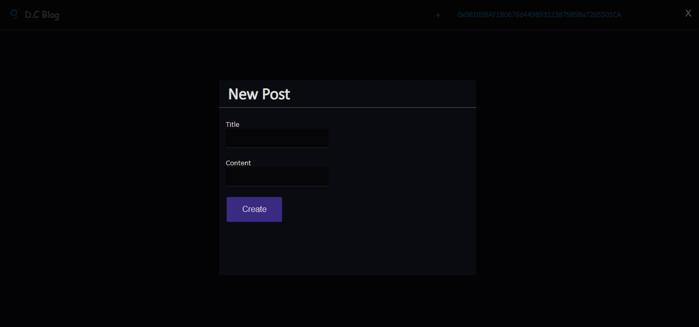
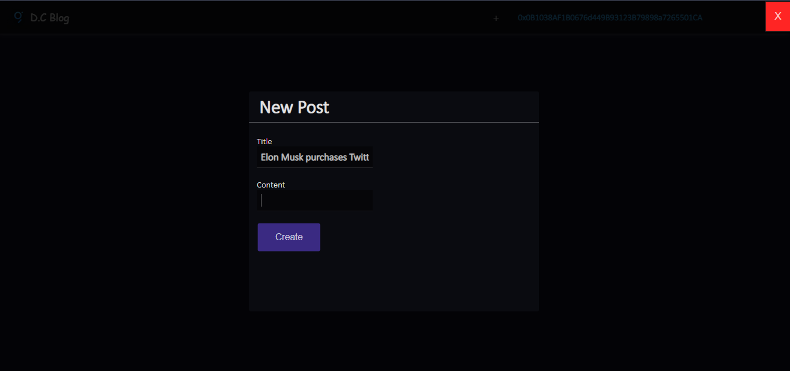
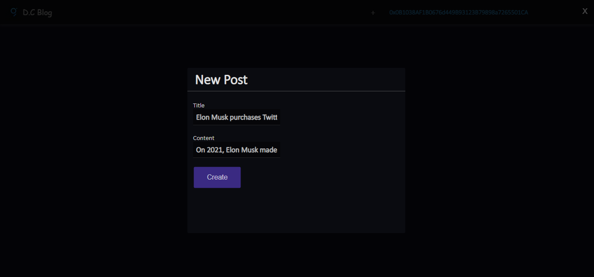
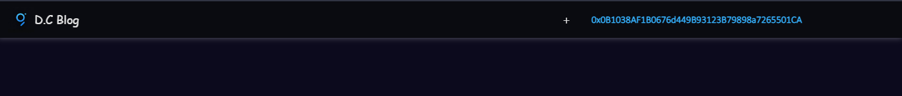

# Decentralized Blog

### Table of Contents

-   [Title](#solidity-internship-assessment)
-   [Description](#description)
    -   [Follow Smart Contract](#follow-smart-contract)
    -   [Post Smart Contract](#post-smart-contract)
    -   [UserProfile Smart Contract](#userprofile-smart-contract)
-   [Screenshots](#screenshots)

## Description

A Decentralized blog which contains three smart contracts;

-   Follow Smart Contract
-   Post Smart Contract
-   UserProfile Smart Contract

### Follow

**Follow Smart Contract** was created to allow user addresses follow other user addresses available on chain. The following functionalities were included:

-   A function that allows users to follow another user by providing the user's public address
-   A function that allows users to unfollow a user they are currently following
-   A function that allows users to view the list of users they are following, as well as the list of users who are following them.

### Post Smart Contract

**Post Smart Contract** was created to allow users to post on chain having the following functionalities:

-   A function that allows users to create a post by providing the content, title, and any other relevant info.
-   A function that allows to edit or delete their posts.
-   A function that allows users to view other user's posts.Smart Contrac

### UserProfile Smart Contract

**User Profile Smart Contract** was created on chain having the following functionalities:

-   A function that allows users to register by providing their personal information such as name, email, pro file picture. etc
-   A function that allows users to update their personal info.
-   A function that allows other users to view a user's public profile info.

## Screenshots

